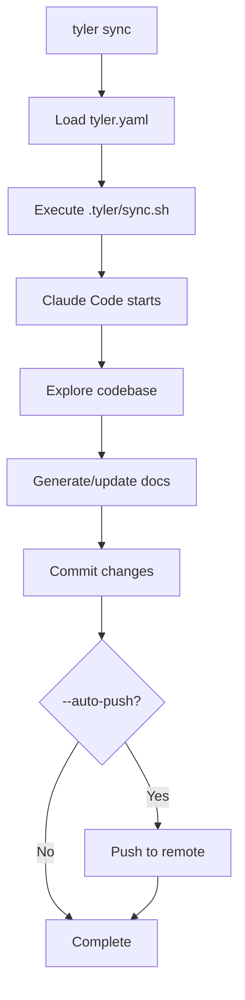

# API Reference

Complete reference for Tyler Doc Agent commands, configuration, and programmatic usage.

## Table of Contents

- [Commands](#commands)
  - [tyler init](#tyler-init)
  - [tyler sync](#tyler-sync)
  - [tyler sync-forever](#tyler-sync-forever)
- [Configuration](#configuration)
  - [tyler.yaml](#tyleryaml)
  - [Configuration Schema](#configuration-schema)
- [Generated Files](#generated-files)
  - [.tyler/ Directory](#tyler-directory)
  - [Prompt Files](#prompt-files)
  - [Shell Scripts](#shell-scripts)
- [Documentation Styles](#documentation-styles)
- [Exit Codes](#exit-codes)
- [Environment Variables](#environment-variables)

---

## Commands

### tyler init

Initialize documentation generation for a project.

#### Synopsis

```bash
tyler init [options]
```

#### Description

Creates the Tyler documentation agent configuration, generates a custom prompt tailored to your codebase, and sets up shell scripts for documentation generation.

#### Options

| Option | Type | Default | Description |
|--------|------|---------|-------------|
| `-r, --repo <path>` | string | `./` | Repository path to document |
| `-o, --output-dir <path>` | string | `docs` | Documentation output directory |
| `-s, --style <style>` | string | `comprehensive` | Documentation style (see [styles](#documentation-styles)) |
| `--no-examples` | boolean | - | Skip code examples generation |
| `--no-github-pages` | boolean | - | Skip GitHub Pages setup |

#### Interactive Prompts

When options are not provided via flags, Tyler prompts interactively:

1. **Documentation style**: Choose from comprehensive, api-focused, tutorial, minimal
2. **Output directory**: Where to generate documentation (default: `docs`)
3. **Include code examples**: Whether to generate working code examples
4. **Setup GitHub Pages**: Create Jekyll configuration for GitHub Pages
5. **Site title**: Title for GitHub Pages site
6. **Site description**: Description for GitHub Pages site

#### Preflight Checks

Before initialization, Tyler performs these checks:

1. **Git repository**: Verifies current directory is a git repo
2. **Git remotes**: Ensures at least one remote is configured
3. **Claude Code**: Tests that Claude Code CLI is installed and working

#### What It Creates

```
.tyler/
├── prompt.md              # Custom-generated documentation prompt
├── sync.sh                # Single iteration script
├── tyler-forever.sh       # Continuous loop script
└── deploy-docs.sh         # GitHub Pages deployment script

tyler.yaml                 # Configuration file

docs/
└── _config.yml           # Jekyll configuration (if --github-pages)
```

#### Examples

**Interactive mode (recommended for first-time setup)**:
```bash
tyler init
```

**Non-interactive with all options**:
```bash
tyler init \
  --style comprehensive \
  --output-dir documentation \
  --repo ./my-project
```

**API-focused documentation without GitHub Pages**:
```bash
tyler init --style api-focused --no-github-pages
```

**Minimal setup for quick docs**:
```bash
tyler init --style minimal --no-examples
```

#### Exit Codes

| Code | Meaning |
|------|---------|
| 0 | Success |
| 1 | Preflight check failed (not a git repo, no remotes, Claude Code not configured) |
| 1 | Failed to generate custom prompt |
| 1 | Failed to create .tyler/ directory or files |

#### Common Issues

**Error: Not a git repository**
```bash
git init
git remote add origin https://github.com/user/repo.git
tyler init
```

**Error: Claude Code is not properly configured**
```bash
npm install -g @anthropic-ai/claude-code
claude  # Run setup wizard
tyler init
```

**Error: Target directory does not exist**
```bash
# If documenting a different repo
mkdir -p ./my-project
cd my-project
tyler init
```

---

### tyler sync

Run one iteration of documentation generation.

#### Synopsis

```bash
tyler sync [options]
```

#### Description

Executes the `.tyler/sync.sh` script once, running Claude Code to explore the codebase and generate/update documentation. Useful for testing the agent or making incremental updates.

#### Options

| Option | Type | Default | Description |
|--------|------|---------|-------------|
| `-r, --repo <path>` | string | `./` | Repository path |
| `--auto-push` | boolean | `false` | Automatically commit and push documentation changes |

#### Requirements

- Must run `tyler init` first to create `tyler.yaml`
- Must be in a git repository
- Claude Code must be configured

#### What It Does

1. Validates `tyler.yaml` exists
2. Executes `.tyler/sync.sh`:
   - Runs Claude Code with the custom prompt
   - Agent explores codebase
   - Agent writes/updates documentation files
   - Agent commits changes (if any)
3. Optionally pushes to remote (with `--auto-push`)

#### Examples

**Single iteration (test the agent)**:
```bash
tyler sync
```

**Generate and push changes**:
```bash
tyler sync --auto-push
```

**Sync specific repository**:
```bash
tyler sync --repo ./my-project
```

#### Use Cases

1. **Testing**: Test the agent before committing to a long run
2. **Incremental Updates**: Make small documentation updates
3. **CI/CD**: Run in automated pipelines
4. **Review**: Generate docs, review, then iterate

#### Process Flow



#### Exit Codes

| Code | Meaning |
|------|---------|
| 0 | Success |
| 1 | Configuration file not found (run `tyler init`) |
| 1 | Invalid configuration |
| 1 | Claude Code execution failed |

#### Graceful Shutdown

Press Ctrl+C to stop gracefully:
- Sends SIGINT to Claude Code process
- Waits for current operation to complete
- Cleans up and exits

---

### tyler sync-forever

Run documentation generation continuously until complete.

#### Synopsis

```bash
tyler sync-forever [options]
```

#### Description

Executes the `.tyler/tyler-forever.sh` script, running Claude Code in an infinite loop. The agent will explore, document, and improve documentation iteratively until it determines the documentation is comprehensive, or you stop it with Ctrl+C.

#### Options

| Option | Type | Default | Description |
|--------|------|---------|-------------|
| `-r, --repo <path>` | string | `./` | Repository path |

#### Requirements

- Must run `tyler init` first
- Must be in a git repository
- Claude Code must be configured

#### What It Does

```bash
# Simplified version of what runs
while :; do
  cd ${repo}
  claude -p < .tyler/prompt.md
  sleep 2
done
```

**Agent Behavior**:
1. **Exploration Phase** (2-5 iterations): Understands codebase
2. **Structure Phase** (1-2 iterations): Creates docs structure
3. **Generation Phase** (10-20 iterations): Writes documentation
4. **Enhancement Phase** (3-5 iterations): Polishes and improves
5. **Self-Termination**: Stops when quality standards met

#### Examples

**Start continuous documentation generation**:
```bash
tyler sync-forever
```

**Document specific repository**:
```bash
tyler sync-forever --repo ./my-project
```

**Recommended workflow**:
```bash
# Initialize
tyler init

# Test with single run
tyler sync

# If satisfied, run continuously
tyler sync-forever

# Let it run for 30-60 minutes
# Press Ctrl+C when satisfied or let it self-terminate
```

#### Monitoring Progress

**Check scratchpad**:
```bash
# View agent's exploration notes
cat docs/.agent/exploration.md

# View TODO list and progress
cat docs/.agent/TODO.md

# Watch git commits in real-time
watch -n 5 git log --oneline -10
```

**Check documentation output**:
```bash
# List generated files
ls -lR docs/

# View specific documentation
cat docs/index.md
cat docs/api/index.md
```

#### Runtime Expectations

| Project Size | Expected Runtime | Typical Cost |
|-------------|------------------|--------------|
| Small (500 lines) | 20-30 minutes | $4-6 |
| Medium (5K lines) | 30-45 minutes | $6-10 |
| Large (50K lines) | 45-60 minutes | $10-15 |

#### Self-Termination

The agent will stop when it determines documentation is complete:

**Quality Standards**:
- ✅ All major APIs documented
- ✅ Architecture clearly explained
- ✅ 5+ working code examples
- ✅ Getting started guide complete
- ✅ Internal links work
- ✅ GitHub Pages configured

**Termination Methods**:
- Updates `docs/.agent/TODO.md` with "COMPLETE" status
- Exits normally
- Occasionally uses `pkill` to terminate its own process

**If it doesn't self-terminate**:
- Let it run longer (might be working on polish)
- Check `docs/.agent/TODO.md` for remaining tasks
- Press Ctrl+C to stop manually
- Review generated documentation
- Run again if needed

#### Exit Codes

| Code | Meaning |
|------|---------|
| 0 | Success (self-terminated or Ctrl+C) |
| 1 | Configuration not found |
| 1 | Invalid configuration |
| 130 | Interrupted by user (Ctrl+C) |

#### Best Practices

1. **Let it run**: Minimum 30 minutes for initial docs
2. **Don't micromanage**: Agent knows what it's doing
3. **Check progress**: Monitor `docs/.agent/TODO.md`
4. **Review after**: Check quality before deploying
5. **Iterate**: Run again if documentation needs improvement

---

## Configuration

### tyler.yaml

Main configuration file for Tyler Doc Agent.

#### Location

Created in the repository root during `tyler init`.

#### Format

```yaml
# Repository to document
repo: ./

# Output directory for documentation
outputDir: docs

# Documentation style
# Options: comprehensive, api-focused, tutorial, minimal
style: comprehensive

# Include working code examples
includeExamples: true

# Setup GitHub Pages
generateGithubPages: true

# GitHub Pages configuration (if generateGithubPages: true)
siteTitle: My Project Documentation
siteDescription: Comprehensive documentation for my project
siteTheme: jekyll-theme-cayman
```

#### Configuration Schema

| Field | Type | Required | Default | Description |
|-------|------|----------|---------|-------------|
| `repo` | string | Yes | `./` | Repository path to document |
| `outputDir` | string | Yes | `docs` | Documentation output directory |
| `style` | string | Yes | `comprehensive` | Documentation style |
| `includeExamples` | boolean | No | `true` | Whether to include code examples |
| `generateGithubPages` | boolean | No | `true` | Setup Jekyll for GitHub Pages |
| `siteTitle` | string | No | `Project Documentation` | GitHub Pages site title |
| `siteDescription` | string | No | `Comprehensive documentation` | GitHub Pages site description |
| `siteTheme` | string | No | `jekyll-theme-cayman` | Jekyll theme for GitHub Pages |

#### Example Configurations

**API-focused documentation**:
```yaml
repo: ./
outputDir: documentation
style: api-focused
includeExamples: true
generateGithubPages: false
```

**Minimal documentation for internal tool**:
```yaml
repo: ./
outputDir: docs
style: minimal
includeExamples: false
generateGithubPages: false
```

**Tutorial-style documentation**:
```yaml
repo: ./
outputDir: docs
style: tutorial
includeExamples: true
generateGithubPages: true
siteTitle: Learn My Framework
siteDescription: Step-by-step tutorials for my framework
siteTheme: jekyll-theme-minimal
```

---

## Generated Files

### .tyler/ Directory

Created during `tyler init`, contains all Tyler-generated scripts and prompts.

#### Structure

```
.tyler/
├── prompt.md              # Custom documentation prompt
├── sync.sh                # Single iteration script
├── tyler-forever.sh       # Continuous loop script
└── deploy-docs.sh         # Deployment script
```

#### Files

**prompt.md**
- Custom-generated prompt tailored to your codebase
- Created by Claude SDK analyzing your project
- Editable after generation
- Used by Claude Code agent

**sync.sh**
- Single iteration execution script
- Called by `tyler sync` command
- Runs Claude Code once with the prompt

**tyler-forever.sh**
- Continuous loop execution script
- Called by `tyler sync-forever` command
- Infinite loop with 2-second delay between iterations

**deploy-docs.sh**
- GitHub Pages deployment script
- Commits and pushes documentation
- Run manually: `bash .tyler/deploy-docs.sh`

#### Customization

All files in `.tyler/` are safe to edit:

```bash
# Customize the prompt
vim .tyler/prompt.md

# Modify the sync script
vim .tyler/sync.sh

# Change deployment behavior
vim .tyler/deploy-docs.sh
```

**Note**: Re-running `tyler init` will regenerate these files.

---

## Documentation Styles

Tyler offers four pre-configured documentation styles.

### Comprehensive

**Best for**: Libraries, frameworks, complex applications

**Structure**:
```
docs/
├── index.md
├── architecture/
│   ├── overview.md
│   ├── design-decisions.md
│   └── data-flow.md
├── api/
│   └── [modules].md
├── guides/
│   ├── getting-started.md
│   └── [features].md
├── examples/
│   ├── basic-usage.md
│   └── advanced.md
└── contributing/
    └── development.md
```

**Features**:
- Complete architecture documentation
- Full API reference
- Multiple guides
- Real-world examples
- Contributing guidelines

**Typical Output**: 20-30 files

### API-Focused

**Best for**: SDKs, APIs, developer tools

**Structure**:
```
docs/
├── index.md
├── api/
│   └── [modules].md
├── examples/
│   ├── basic.md
│   └── advanced.md
└── types/
    └── reference.md
```

**Features**:
- Detailed API documentation
- Parameter/return type docs
- Code example per API
- Type definitions
- Integration patterns

**Typical Output**: 15-20 files

### Tutorial

**Best for**: Educational tools, learning resources

**Structure**:
```
docs/
├── index.md
├── tutorials/
│   ├── lesson-1.md
│   └── lesson-N.md
├── examples/
│   └── [examples].md
└── reference/
    └── [reference].md
```

**Features**:
- Progressive learning path
- Step-by-step tutorials
- Hands-on examples
- Best practices
- Common pitfalls

**Typical Output**: 10-15 files

### Minimal

**Best for**: Simple projects, internal tools

**Structure**:
```
docs/
├── index.md
├── api/
│   └── reference.md
└── examples/
    └── basic.md
```

**Features**:
- Getting started guide
- Essential API reference
- Basic examples
- Configuration

**Typical Output**: 5-8 files

---

## Exit Codes

Standard exit codes used by Tyler commands.

| Code | Meaning | Context |
|------|---------|---------|
| 0 | Success | Command completed successfully |
| 1 | General error | Configuration missing, invalid, or execution failed |
| 130 | Interrupted by user | Ctrl+C pressed (SIGINT) |
| 143 | Terminated | SIGTERM received |

---

## Environment Variables

Tyler respects the following environment variables:

| Variable | Description | Default |
|----------|-------------|---------|
| `ANTHROPIC_API_KEY` | Claude API key (required by Claude Code) | - |
| `SKIP_CLAUDE_TEST` | Skip Claude Code preflight check (for testing) | `false` |

**Example**:
```bash
export ANTHROPIC_API_KEY=your_api_key
tyler init
```

---

## Next Steps

- [Commands Deep Dive](commands.md) - Detailed command behavior and internals
- [Configuration Guide](configuration.md) - Advanced configuration options
- [Examples](../examples/basic-usage.md) - Real-world usage examples

---

[← Back to Index](../index.md) | [Guides →](../guides/getting-started.md)
