# Architecture Overview

Tyler Doc Agent is built on the battle-tested "Ralph Wiggum" infinite loop pattern from [RepoMirror](https://github.com/repomirrorhq/repomirror), adapted specifically for documentation generation. This architecture enables AI agents to work iteratively, learn progressively, and self-terminate when complete.

## High-Level Architecture


## Core Components

### 1. CLI Layer (`src/cli.ts`)

The command-line interface built with Commander.js that provides three main commands:

- **`tyler init`**: Initialize documentation generation
- **`tyler sync`**: Run one documentation iteration
- **`tyler sync-forever`**: Run continuous documentation loop

```typescript
program
  .command("doc-init")
  .description("Initialize documentation generation agent")
  .option("-s, --style <style>", "Documentation style")
  .action((options) => docInit(options));
```

### 2. Command Implementations (`src/commands/`)

#### `init.ts` - Initialization Command

Responsible for:
1. **Interactive setup** via inquirer prompts
2. **Preflight checks** (git, Claude Code, repository)
3. **Prompt generation** using Claude SDK
4. **File creation** (.tyler/ directory, scripts, config)


**Key Features**:
- Loads existing `tyler.yaml` for defaults
- Runs preflight checks (git repo, remotes, Claude Code)
- Uses Claude SDK to generate custom prompt
- Creates executable shell scripts from templates

#### `sync.ts` - Single Iteration

Executes one documentation generation cycle:
1. Validates configuration exists
2. Runs `.tyler/sync.sh` script
3. Handles graceful shutdown (SIGINT/SIGTERM)
4. Optional auto-push to git

**Use Cases**:
- Testing documentation agent
- Incremental updates
- CI/CD integration

#### `sync-forever.ts` - Continuous Loop

Runs documentation generation in an infinite loop:
1. Validates configuration
2. Executes `.tyler/tyler-forever.sh`
3. Manages process lifecycle
4. Handles Ctrl+C gracefully

**The Ralph Wiggum Pattern**:
```bash
while :; do
  cd ${repo}
  claude -p --dangerously-skip-permissions < ../.tyler/prompt.md
  sleep 2
done
```

### 3. Template System (`templates/`)

Shell script templates with placeholder variables:

#### `sync.sh.template`
Single iteration execution:
```bash
#!/bin/bash
set -e

cd ${repo}
claude -p --dangerously-skip-permissions < .tyler/prompt.md

echo "✅ Documentation sync complete"
```

#### `tyler-forever.sh.template`
Continuous loop execution:
```bash
#!/bin/bash
set -e

echo "🤖 Tyler Doc Agent - Continuous Documentation Generation"
echo "Press Ctrl+C to stop"

while :; do
  echo ""
  echo "📚 Documentation iteration starting at $(date)"

  cd ${repo}
  claude -p --dangerously-skip-permissions < .tyler/prompt.md

  sleep 2
done
```

#### `deploy-docs.sh.template`
GitHub Pages deployment:
```bash
#!/bin/bash
set -e

git add ${outputDir}
git commit -m "docs: Update documentation"
git push origin main

echo "📚 Documentation deployed successfully!"
```

### 4. Prompt Templates (`prompts/`)

Three pre-configured documentation styles:

#### Comprehensive (Default)
- Full architecture documentation
- Complete API reference
- How-to guides
- Working examples
- Contributing guidelines

#### API-Focused
- Detailed API documentation
- Parameter/return types
- Code examples per API
- Type definitions

#### Tutorial
- Progressive learning path
- Step-by-step tutorials
- Hands-on examples
- Best practices

## Data Flow


### Iteration Cycle

1. **Input**: Repository codebase + custom prompt
2. **Agent Exploration**: Claude Code reads files, searches code
3. **Agent Planning**: Creates TODO list in `docs/.agent/`
4. **Documentation Generation**: Writes markdown files in `docs/`
5. **Commit**: Git commit after major section
6. **Loop**: Repeat until complete

## Agent Behavior Patterns

### Phase 1: Exploration (2-5 iterations)


**What happens**:
- Agent systematically explores codebase
- Identifies key components and modules
- Understands architecture patterns
- Documents findings in scratchpad
- Creates prioritized documentation TODO list

**Tools used**: Read, Glob, Grep, Bash (ls)

### Phase 2: Structure Creation (1-2 iterations)


**What happens**:
- Creates documentation directory hierarchy
- Sets up Jekyll configuration
- Creates placeholder files
- Establishes navigation structure

**Tools used**: Write, Bash (mkdir)

### Phase 3: Content Generation (10-20 iterations)


**What happens**:
- Writes comprehensive documentation
- Creates working code examples
- Tests examples in scratchpad
- Commits after each major section
- Updates TODO list

**Tools used**: Read, Write, Edit, Bash

### Phase 4: Enhancement (3-5 iterations)


**What happens**:
- Adds links between related sections
- Creates Mermaid diagrams
- Adds additional examples
- Improves clarity and flow
- Final quality pass

**Tools used**: Edit, Read

### Phase 5: Self-Termination


**Quality Standards**:
- [ ] All major APIs documented
- [ ] Architecture explained
- [ ] 5+ working examples
- [ ] Getting started guide complete
- [ ] Internal links work
- [ ] GitHub Pages configured

**Self-termination methods**:
- Normal exit after marking TODO complete
- Sometimes uses `pkill` to terminate own process
- Updates TODO.md with "COMPLETE" status

## Configuration System

### Configuration File (`tyler.yaml`)

```yaml
# Repository to document
repo: ./

# Output directory
outputDir: docs

# Documentation style
style: comprehensive

# Feature flags
includeExamples: true
generateGithubPages: true

# GitHub Pages config
siteTitle: Project Documentation
siteDescription: Comprehensive documentation
siteTheme: jekyll-theme-cayman
```

### Configuration Loading


## Process Management

### Graceful Shutdown

```typescript
let cleanup: (() => void) | null = null;

const handleShutdown = (signal: string) => {
  console.log(`\n${chalk.yellow(`Received ${signal}, shutting down...`)}`);

  if (cleanup) {
    cleanup();
  }

  process.exit(0);
};

process.on('SIGINT', () => handleShutdown('SIGINT'));
process.on('SIGTERM', () => handleShutdown('SIGTERM'));
```

**Features**:
- Handles SIGINT (Ctrl+C) and SIGTERM
- Cleans up child processes
- Graceful exit without data loss
- User-friendly messaging

### Process Lifecycle

```mermaid
sequenceDiagram
    participant User
    participant Tyler CLI
    participant Shell Script
    participant Claude Agent
    participant Git

    User->>Tyler CLI: tyler sync-forever
    Tyler CLI->>Shell Script: Execute tyler-forever.sh

    loop Until Complete
        Shell Script->>Claude Agent: Run Claude Code
        Claude Agent->>Git: Read codebase
        Git-->>Claude Agent: Code content
        Claude Agent->>Git: Write docs
        Claude Agent->>Git: Commit changes
    end

    User->>Tyler CLI: Ctrl+C
    Tyler CLI->>Shell Script: SIGTERM
    Shell Script->>Claude Agent: Kill process
    Claude Agent-->>Tyler CLI: Exit gracefully
    Tyler CLI->>User: ✅ Shutdown complete
```



## Cost & Performance Model

### Cost Calculation

**Claude Sonnet 4.5 Pricing**:
- Input: $3 per million tokens
- Output: $15 per million tokens
- Average: ~$10.50 per hour

**Typical Documentation Run**:
- **Small project** (500 lines): 20-30 min, $4-6
  - ~100K input tokens
  - ~50K output tokens

- **Medium project** (5K lines): 30-45 min, $6-10
  - ~200K input tokens
  - ~100K output tokens

- **Large project** (50K lines): 45-60 min, $10-15
  - ~400K input tokens
  - ~200K output tokens

### Performance Optimization

**Techniques**:
1. **Smart exploration**: Agent doesn't read every file
2. **Incremental commits**: Reduces context per iteration
3. **Scratchpad pattern**: Maintains state across iterations
4. **Self-termination**: Stops when quality is sufficient

## Comparison to RepoMirror

### RepoMirror (Code Transformation)

```
Source Repo → Agent → Target Repo
           ↓
     .repomirror/
       - prompt.md
       - sync.sh
       - ralph.sh
```

**Purpose**: Transform code (Python→TypeScript, React→Vue)
**Repos**: 2 (source + target)
**Output**: Transformed code
**Commands**: 11 (init, sync, push, pull, remote, etc.)

### Tyler Doc Agent (Documentation)

```
Repository → Agent → docs/
          ↓
      .tyler/
       - prompt.md
       - sync.sh
       - tyler-forever.sh
```

**Purpose**: Generate documentation
**Repos**: 1 (single repo)
**Output**: Markdown documentation
**Commands**: 3 (init, sync, sync-forever)

### Shared Patterns

Both use:
- **Ralph Wiggum infinite loop**
- **Claude Code as the agent**
- **Template-based script generation**
- **Custom prompt generation via Claude SDK**
- **Scratchpad directory for agent state**
- **Incremental git commits**
- **Self-termination patterns**

## Error Handling

### Preflight Checks


### Runtime Error Handling

**Script failures**:
- Non-zero exit codes stop execution
- Error messages displayed to user
- Cleanup handlers invoked

**Agent errors**:
- Claude Code errors logged
- User can review and retry
- Partial progress preserved in git

## Security Considerations

### Safe Operations

Tyler only performs safe operations:
- **Reads**: Explores codebase without modification
- **Writes**: Only to `docs/` directory
- **Commits**: Only documentation changes
- **No network**: Except Claude API and git

### User Control

- User reviews generated prompt before running
- User can stop agent at any time (Ctrl+C)
- User can modify `.tyler/prompt.md`
- User controls git push (not automatic unless --auto-push)

## Next Steps

- [Design Decisions](design-decisions.md) - Key architectural choices and rationale
- [Agent Behavior](agent-behavior.md) - Deep dive into agent patterns
- [Data Flow](data-flow.md) - Detailed data flow diagrams

---

[← Back to Index](../index.md) | [API Reference →](../api/index.md)
